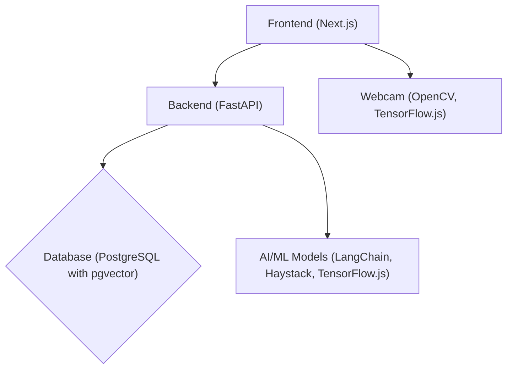

# CoChat 프로젝트 기획안

## 1️⃣ 팀 소개

---

### ♦️ 팀명

- 한다스(한번에 다 스마트하게)


### ♦️ 팀원 및 역할

| 이름 | 역할 | 담당 업무 |
| --- | --- | --- |
| 오진우 | 팀장/풀스택 | 프로젝트 총괄, API 명세서 작성, 외부 메신저(Slack 등) 연동 확인, 풀스택 개발 |
| 마수한 | PM | 깃허브 칸반보드(Task) 관리, 노션 회의록 작성, 디자인 리서치 및 보조 |
| 문정현 | 디자이너 | 로우파이(Lo-Fi) 기획 및 최종 서비스 화면 디자인 |
| 이창현 | 풀스택 | API 명세서 작성, 외부 메신저(Slack 등) 연동 확인, 풀스택 개발 |
| 김구 | 생성AI | LLM 프롬프트/RAG 구축, API 설계 회의 참여 |
| 김선호 | 클라우드 | 깃허브 Repo 생성, 로컬 개발 환경 셋업, 서버 인프라 구축 |

## 2️⃣ 프로젝트 소개

---

### ♦️ 해커톤 **주제**

> **AI + TOGETHER + Productivity**
AI 기반 사내 메신저 & 업무 알림 통합 서비스
> 

---

### ♦️ 문제 정의

#### 🔸**해결하고자 하는 문제 (고객의 페인 포인트)**

- **알림 파편화:** 슬랙, 지라, 노션 등 다양한 협업 툴에서 쏟아지는 알림으로 인해 하루 평균 수십 번의 업무 흐름 단절 발생.
- **우선순위의 부재:** 장애 발생 같은 크리티컬한 상황과 단순 회식 공지가 동일한 비중으로 전달되어, 정보 파악을 위한 불필요한 리소스 낭비.

#### 🔸**문제 선정 배경: 왜 이 프로젝트를 선택했는지?**


- **사회적 배경:** 하이브리드 워크와 비동기 협업 툴 사용이 보편화되면서 '알림 피로도(Notification Fatigue)'가 직장인 번아웃의 주요 원인으로 부상.
- **기술적 배경:** LLM의 발전으로 단순 키워드 필터링을 넘어 사내 데이터(RAG)를 활용해 문맥(Context)을 이해한 우선순위 분류 및 요약이 실현 가능한 단계에 도달함.

#### 🔸**타겟 고객: 서비스 주요 사용자층**

- **주요 사용자층:** 협업 툴 사용 빈도가 높은 IT 스타트업 및 테크 기업 종사자.
- **특성:** 실시간 소통과 집중 업무(Deep Work)의 균형이 절실한 기획자, 개발자, 운영자.

#### 🔸**페르소나: 구체적인 고객군 특성과 상황**


- **이름:** 김프로 (32세, 3년 차 프론트엔드/풀스택 개발자)
- **상황:** 3개의 프로젝트를 동시에 관리하며 슬랙 채널만 50개 이상 참여 중. 회의나 코드 작성 중에도 끊임없이 울리는 알림 때문에 문서 작성 집중 시간이 하루 1시간 미만임. 서버 다운 같은 중요 이슈를 놓칠까 봐 방해금지 모드도 켜지 못하는 불안감을 느낌.

#### 🔸**시장성: 관련 시장 규모, 성장 가능성**

- **시장 규모:** 전 세계 협업 소프트웨어 시장은 매년 약 13% 이상 성장 중이며, 생산성 도구(SaaS) 시장의 핵심은 '통합'과 '자동화'로 이동 중.
- **성장 가능성:** 단순 메신저 시장을 넘어, AI 비서 시장과 결합하여 기업용 생산성 솔루션(B2B)으로서 높은 확장성을 가짐.

---

### ♦️ 해결 방안 제안

#### 🔸**서비스 개요(소개)**

> 흩어진 알림을 한곳으로 모으고, AI가 응급도(Critical/High/Medium/Low)를 판단하여 사용자에게 최적의 시점에 브리핑하는 '업무용 알림 관제 센터'.
> 

#### 🔸서비스명


> **CoChat** (for Buisness)
→ '함께'를 뜻하는 영어 접두사 **'Co-'**와 소통을 의미하는 **'Chat'**의 합성어입니다.
> 

슬랙, 지라, 메일 등으로 파편화된 모든 업무 대화(Chat)를 하나의 관제 센터로 **연결(Connect)**하고, 알림 피로도 없이 팀원들이 **다 함께(Collaboration)** 온전히 집중하여 소통할 수 있는 통합 업무 환경을 만든다는 비전을 담고 있습니다.

#### 🔸서비스 **핵심 기능 6가지**

1. **다채널 알림 통합 수집 (메신저 통합)**

Slack, Jira, Gmail 등의 API를 연동하여 실시간 알림을 중앙에서 수집합니다.


---

1. **AI 문맥 기반 우선순위 분류**

LLM을 통해 단순 키워드가 아닌 문맥을 파악하여 알림의 긴급도를 분류하고 한 줄 요약 서비스를 제공합니다.


---

1. **시각 AI 기반 몰입(딥워크) 모드**

**웹캠**을 활용한 사용자의 시선 및 자세 분석으로 집중 상태를 파악하고, 긴급도에 따른 알림 전달 시점을 자동으로 조절합니다.


---

1. **일일 알림 브리핑 리포트**

집중 모드 해제 시 또는 퇴근 전, 미확인 알림을 중요도 순으로 큐레이션하여 제공합니다.
⇒ 필요시 언제든 알림 요약 브리핑 가능


---

1. **자동 답장 초안 제시**

수신된 메시지에 대해 3가지 스타일(공식/친근/간결)의 답장 초안을 제안하며, 쓸수록 사용자의 말투를 학습하여 품질 고도화


---

1. **메시지 → 캘린더 자동 등록**

메시지 내 날짜/시간 정보를 AI가 자동 감지하여 일정 등록 제안 또는 자동 등록 (예: "다음 주 화요일 3시 미팅 어때요?" → 일정 제안)


#### 🔸**예상 서비스 화면 흐름**

1. **초기 설정:** 연동할 업무 툴 로그인(OAuth) 및 우선순위 기준 설정.
2. **대시보드:** 현재 수집된 알림 현황과 AI 요약 리스트 실시간 확인.
3. **딥워크 실행:** 모드 활성화 시 화면이 단순화되며, 몰입을 방해하는 알림 차단 시작.
4. **브리핑 화면:** 집중 종료 후, AI가 정리한 "지금 당장 확인해야 할 일" 팝업 노출.

#### 🔸경쟁 서비스 및 차별점

- **유사 서비스:**

> **Station:** 여러 웹 앱(Slack, Notion, Gmail 등)을 한 곳에 모아주는 워크스페이스 통합 브라우저입니다. 하지만 단순 UI 통합에 그치며, 알림의 '내용'을 분석하여 우선순위를 정해주지는 않습니다. [[링크]](https://getstation.com/)
**Rambox**: 다양한 비즈니스 및 개인용 앱을 하나의 인터페이스로 관리할 수 있게 해주는 커뮤니케이션 허브입니다. Station과 유사하게 통합에 집중되어 있으며 AI 기반의 맥락 분석 기능은 부재합니다. [[링크]](https://rambox.app/)
**Sunsama**: 여러 툴의 업무를 캘린더와 연동하여 관리하는 '일일 계획' 도구입니다. 알림을 태스크(To-do)화하는 데 최적화되어 있으나, 실시간 알림의 긴급도 분석이나 시각 AI를 통한 몰입 지원 기능은 약합니
> 
> 
> 다. [[링크]](https://www.sunsama.com/)
> **Akiflow**: 캘린더, 작업, 스케줄을 하나로 결합한 AI 기반 생산성 도구입니다. 툴 간의 데이터 동기화는 뛰어나지만, 수신되는 메시지의 '어조'나 '문맥'을 파악해 자동 답장을 제안하는 기능은 포함되어 있지 않습니다. [[링크]](https://akiflow.com/)
> **Slack AI**: 슬랙 내부의 대화 내용을 요약하고 검색하는 기능을 제공합니다. 강력한 기능을 갖추고 있으나, Jira, 이메일, 외부 메신저 등 '타 플랫폼'의 알림까지 통합하여 교차 분석하는 데는 한계가 있습니다. [[링크]](https://slack.com/intl/ko-kr/resources/using-slack/slack-ai-features-kr)
> 
- **차별점:**

> **교차 플랫폼 문맥 인지(Cross-Platform Context Awareness):** 단순히 알림을 모으는 것을 넘어, 서로 다른 플랫폼(예: Jira의 이슈 티켓과 Slack의 논의 사항) 간의 연관성을 AI가 파악하여 하나의 맥락으로 브리핑(Briefing)합니다.
**AI 기반 우선순위 지정(AI-Driven Prioritization):** 사용자의 직무와 과거 반응 데이터를 학습하여, 단순 키워드가 아닌 '업무 긴급도'와 '의사결정 필요 여부'에 따라 알림 순위를 실시간으로 재배치합니다.
**능동적 몰입 지원(Active Deep Work Support):** 타 서비스가 단순히 알림을 끄는 '방해금지 모드'라면, CoChat은 웹캠(OpenCV)을 통해 사용자의 시선이나 자리를 확인하여 실제 **몰입(Deep Work)** 여부를 판단하고, 최적의 타이밍에 요약 보고서를 전달합니다.
> 

---

### ♦️ 서비스 설계 방향성

#### **🔸핵심 디자인 컨셉**

> **인지 부하 최소화 (Cognitive Load Reduction)**
> 
- **Focus-First Dark Mode:** 장시간 화면을 주시하는 개발자 및 기획자의 시각적 피로도를 낮추기 위해 다크 모드를 기본 UI로 채택합니다.
- **Triage Color System:** 불필요한 시각적 노이즈를 배제하고, AI가 분류한 알림의 '응급도'에 따라 직관적인 3단계 우선순위 컬러(Critical: **Red**, High: **Yellow**, Low/Muted: **Blue** 또는 **Gray**)를 적용하여 사용자가 0.1초 만에 상황을 인지하도록 설계합니다.

#### 🔸기술 스택

- **핵심 기술 스택**: Next.js, FastAPI, PostgreSQL, pgvector, LangGraph, ~~Haystack~~, OpenCV, TensorFlow.js
- **주요 기술 목표**: 높은 성능, 확장성, 안정성을 제공하는 시스템 구축
- **주요 기술 가정**:
    - 개발 환경은 로컬 docker-compose 배포 환경은 클라우드 환경(AWS)
    - 데이터 보안 및 개인 정보 보호는 최우선적으로 고려됩니다.
    - AI 모델의 학습 및 개선을 위한 충분한 데이터가 확보됩니다.
    - 사용자 피드백을 기반으로 시스템을 지속적으로 개선합니다.

| 구분 | 기술 스택 | 도입 배경 |
| --- | --- | --- |
| Frontend | Next.js | React 기반의 풍부한 생태계 |
| Backend | FastAPI | 빠른 개발 속도, 높은 성능, 자동 API 문서화, Python 기반의 ML 라이브러리 호환성 |
| Database | PostgreSQL | 안정성, 확장성, ACID 트랜잭션 지원, JSONB 데이터 타입 지원 |
| Vector Database | pgvector | PostgreSQL 확장 기능으로 벡터 임베딩 저장 및 유사성 검색에 최적화 |
| RAG Framework | LangGraph | 다양한 LLM 모델과의 통합, 데이터 연결 및 문서 처리 기능 제공 |
| ~~Document Indexing & Retrieval~~ | ~~Haystack (임의로 적어둠)~~ | ~~LangChain과 함께 사용하기 용이하며, RAG 파이프라인 구축에 필요한 다양한 도구 제공~~ |
| Focus Mode (Webcam) | OpenCV, TensorFlow.js (미정) | 웹캠 기반의 실시간 이미지 처리 및 AI 모델 실행을 위한 효율적인 라이브러리 |
| API | RESTful API | 표준화된 인터페이스, 다양한 클라이언트 지원, 확장성 |
| Containerization | Docker | 일관된 개발 및 배포 환경 제공, 시스템 격리 |
| Orchestration | Docker Compose | 컨테이너 관리 및 오케스트레이션 |

#### 🔸시스템 아키텍처

> **Top-Level building blocks**
> 
- **Frontend (Next.js)**
    - 사용자 인터페이스 제공
    - 알림 표시, 설정 관리, 포커스 모드 제어, 브리핑 리포트 대시보드
    - 하위 구성 요소: 알림 스트림 컴포넌트, 설정 컴포넌트, 포커스 모드 컴포넌트, 브리핑 리포트 컴포넌트
- **Backend (FastAPI)**
    - API 엔드포인트 제공
    - 알림 수집, 긴급성 평가, 관련성 필터링, 자동 응답 생성, 캘린더 통합, 데이터 저장
    - 하위 구성 요소: 알림 처리 모듈, AI 모델 모듈, 데이터베이스 접근 모듈, API 라우터
- **Database (PostgreSQL with pgvector)**
    - 알림 데이터, 사용자 데이터, 모델 데이터 저장
    - 벡터 임베딩 저장 및 유사성 검색
- **AI/ML Models (LangGraph)**
    - 긴급성 평가, 관련성 필터링, 자동 응답 생성, 포커스 감지
    - 하위 구성 요소: RAG 모델, 코사인 유사도 모델, 자동 응답 모델, 포커스 감지 모델

---

> **Top-Level Component Interaction Diagram**
> 



- **Frontend (Next.js) <-> Backend (FastAPI)**: 프론트엔드는 API 요청을 통해 백엔드와 통신합니다. 백엔드는 요청에 대한 응답으로 데이터를 반환합니다.
- **Backend (FastAPI) <-> Database (PostgreSQL with pgvector)**: 백엔드는 데이터베이스에 알림 데이터, 사용자 데이터, 모델 데이터를 저장하고 검색합니다.
- **Backend (FastAPI) <-> AI/ML Models (LangChain, Haystack, TensorFlow.js)**: 백엔드는 AI/ML 모델을 호출하여 알림의 긴급성 평가, 관련성 필터링, 자동 응답 생성 등의 작업을 수행합니다.
- **Frontend (Next.js) <-> Webcam (OpenCV, TensorFlow.js)**: 프론트엔드는 웹캠을 통해 사용자 데이터를 수집하고 AI/ML 모델을 통해 포커스 감지를 수행합니다.

#### 🔸코드 구성 및 작성 규칙

**Domain-Driven Organization Strategy**

- **Domain Separation**: 코드 구조를 비즈니스 도메인(예: 사용자 관리, 알림 처리, AI 모델)별로 분리합니다.
- **Layer-Based Architecture**: 표현 계층, 비즈니스 로직 계층, 데이터 접근 계층, 인프라 계층으로 분리합니다.
- **Feature-Based Modules**: 관련된 기능을 함께 그룹화합니다 (예: 알림 통합, 포커스 모드).
- **Shared Components**: 공통 유틸리티, 타입, 재사용 가능한 컴포넌트를 전용 공유 모듈에 저장합니다.

**Universal File & Folder Structure**

```
/ (멀티 레포 구조)
│
├── 📦 repo: service-frontend          # Next.js 프론트엔드
│   ├── components/
│   │   ├── NotificationStream/
│   │   │   ├── NotificationItem.tsx
│   │   │   └── index.tsx
│   │   ├── Settings/
│   │   │   ├── index.tsx
│   │   │   └── SettingsForm.tsx
│   │   └── ...
│   ├── pages/
│   │   ├── index.tsx
│   │   └── settings.tsx
│   ├── styles/
│   ├── public/
│   ├── utils/
│   └── ...
│
├── 📦 repo: service-backend           # FastAPI 백엔드
│   ├── app/
│   │   ├── api/
│   │   │   ├── endpoints/
│   │   │   │   ├── notifications.py
│   │   │   │   └── users.py
│   │   │   └── deps.py
│   │   ├── core/
│   │   │   ├── models/
│   │   │   │   ├── notification.py
│   │   │   │   └── user.py
│   │   │   ├── services/
│   │   │   │   ├── notification_service.py
│   │   │   │   └── ai_service.py
│   │   │   └── security.py
│   │   ├── db/
│   │   │   ├── database.py
│   │   │   ├── models.py
│   │   │   └── migrations/
│   │   ├── main.py
│   │   └── config.py
│   ├── tests/
│   ├── requirements.txt
│   └── ...
│
├── 📦 repo: service-ml                # AI/ML 모델
│   ├── rag_model/
│   │   ├── train.py
│   │   └── inference.py
│   ├── focus_detection/
│   │   ├── train.py
│   │   └── inference.py
│   └── ...
│
└── 📦 repo: infra                     # 인프라
    ├── docker/
    │   ├── frontend.Dockerfile
    │   ├── backend.Dockerfile
    │   └── ml.Dockerfile
    ├── terraform/                     # 클라우드 리소스 정의
    ├── docker-compose.yml             # 로컬 개발용
    ├── .env.example
    └── README.md
```

#### 🔸데이터 흐름 및 통신 패턴

- **Client-Server Communication**: 프론트엔드는 RESTful API를 통해 백엔드와 통신합니다. API 요청 및 응답은 JSON 형식으로 이루어집니다.
- **Database Interaction**: 백엔드는 SQLAlchemy ORM을 사용하여 데이터베이스와 상호 작용합니다. 데이터베이스 연결 풀링을 통해 성능을 최적화합니다.
- **External Service Integration**: Slack, Jira, Notion과 같은 외부 서비스는 API를 통해 통합됩니다. API 키 및 OAuth를 사용하여 안전하게 인증합니다.
- **Real-time Communication**: 필요에 따라 WebSocket 또는 SSE를 사용하여 실시간 알림 업데이트를 제공합니다.
- **Data Synchronization**: 데이터베이스 트랜잭션을 사용하여 데이터 일관성을 유지합니다.

#### 🔸성능 및 최적화 전략

- 데이터베이스 쿼리 최적화: 인덱싱, 쿼리 캐싱, 불필요한 데이터 조회 방지 등을 통해 데이터베이스 쿼리 성능을 최적화합니다.
- API 응답 캐싱: 자주 사용되는 API 응답은 캐싱하여 불필요한 데이터베이스 호출을 줄입니다.
- AI 모델 최적화: AI 모델의 추론 시간을 줄이기 위해 모델 경량화, 양자화, GPU 가속 등을 적용합니다.
- 비동기 처리: 시간이 오래 걸리는 작업(예: AI 모델 추론, 외부 API 호출)은 비동기적으로 처리하여 메인 스레드의 응답성을 유지합니다.

#### **🔸 개발 로드맵 및 마일스톤**

한정된 해커톤 기간 내에 'AI 기반 알림 통제'라는 핵심 가치를 증명하고, 이후 프로덕트를 고도화하기 위해 다음과 같이 단계별 스프린트를 나눕니다.

**[Phase 1] 해커톤 MVP 개발 (핵심 가치 증명)**

- **1순위 (Core Data & AI):** Slack API 기반 실시간 알림 수집 파이프라인 구축 및 LLM/pgvector를 활용한 문맥 기반 알림 응급도 분류/한 줄 요약 엔진 구현
- **2순위 (User Interface):** 분류된 알림을 확인할 수 있는 Next.js 기반 실시간 알림 관제 대시보드(웹) 구축, (선택) 크롬 익스텐션 팝업 UI
- **3순위 (Advanced Features):** Jira, Notion 등 추가 채널 통합, 고도화된 관련성 필터링, 자동 답장 제안, 캘린더 통합 스케줄링, 미확인 알림 데일리 리포트(Snapshot) 자동 생성

**[Phase 2] 서비스 고도화 (해커톤 이후)**

- **기능 확장:** OpenCV 기반 사용자 몰입도(Deep Work) 감지 연동 및 알림 차단
- **보안 및 안정성:** 데이터 암호화 적용, 시스템 모니터링 및 로깅 체계 구축

#### 🔸리스크 평가 및 대응 전략

**Technical Risk Analysis**

- **Technology Risks**: AI 모델의 정확도 부족, 외부 API 의존성, 웹캠 기반 포커스 감지의 성능 문제
- **Performance Risks**: 데이터베이스 쿼리 성능 저하, API 응답 시간 증가, AI 모델 추론 시간 증가
- **Security Risks**: 사용자 인증 및 권한 부여 취약점, 데이터 유출 가능성, 외부 API 보안 문제
- **Integration Risks**: 외부 서비스 API 변경, 호환성 문제
- **Mitigation Strategies**:
    - AI 모델 학습 데이터 확보 및 모델 개선
    - 외부 API 변경에 대한 모니터링 및 대응
    - 웹캠 기반 포커스 감지 알고리즘 개선 및 성능 최적화
    - 데이터베이스 쿼리 최적화 및 캐싱 전략 적용
    - 사용자 인증 및 권한 부여 강화, 데이터 암호화 적용
    - 외부 서비스 API 호환성 테스트 및 유지보수

---

**Project Delivery Risks**

- **Timeline Risks**: 개발 일정 지연, 기능 구현 복잡성 증가
- **Quality Risks**: 코드 품질 저하, 테스트 부족
- **Deployment Risks**: 배포 환경 문제, 시스템 장애
- **Contingency Plans**:
    - 개발 일정 단축 및 우선순위 조정
    - 외부 전문가 활용
    - 코드 리뷰 및 테스트 강화
    - 배포 전 충분한 테스트 및 검증

#### 🔸**기대 효과 및 결과물 활용 방안**

**◉  정성적 기대 효과 (사회적/개인적 임팩트)**

- **개인적 차원 (Cognitive Relief):** 끊임없는 알림으로 인한 '맥락 전환 비용(Context Switching Cost)'을 최소화하여 인지 부하를 줄이고, 업무 만족도 및 몰입감을 극대화합니다.
- **조직적 차원 (Communication Efficiency):** 중요도가 낮은 단순 확인용 메시지에 대한 즉각적인 반응 압박을 줄여, 조직 전체가 '중요도가 높은 본질적 업무'에 집중하는 문화를 조성합니다.
- **사회적 차원 (Digital Wellness):** 업무와 휴식의 경계를 명확히 하고, 퇴근 후 혹은 휴가 중 발생하는 불필요한 알림 스트레스를 AI가 필터링함으로써 직장인의 디지털 번아웃을 예방합니다.

**◉ 정량적 KPI 및 산출 근거**

- **기술적 구현 및 성능 지표 (Technical Performance)**
    - **다채널 알림 통합 연동 (Multi-Channel Integration)**
        - **목표:** 최소 2개 이상의 이기종 협업 도구(Slack, discord 등) 실시간 API 연동.
        - **산출 근거:** 지식 노동자의 앱 전환(Toggle Tax)으로 인한 주당 **4시간**의 손실을 방지하기 위한 최소 통합 임계치 확보.
        - **원본 링크:** [How Much Time Are You Losing to Tool-Toggling? (HBR)](https://www.google.com/search?q=https://hbr.org/2022/08/how-much-time-are-you-losing-to-tool-toggling)
    - **AI 문맥 분류 정확도 (Classification Accuracy) 85% 이상**
        - **목표:** 4단계 우선순위(Critical/High/Medium/Low) 분류와 실제 데이터 일치율 85% 달성.
        - **산출 근거:** 인간 전문가 간의 분류 일치도(80~90%)에 준하는 신뢰 수준 확보를 통해 사용자 의사결정 지원 가능성 증명.
        - **원본 링크:** [Measuring Inter-Rater Reliability (NCBI)](https://www.ncbi.nlm.nih.gov/pmc/articles/PMC3900052/)
    - **정보 요약 효율성 (Summarization Efficiency) 70% 이상**
        - **목표:** 원문 대비 요약본의 텍스트 압축률 70% 이상 달성.
        - **산출 근거:** LLM 기반 요약 시 핵심 정보 유지와 가독성의 최적 균형점인 70~80% 압축을 통해 사용자의 인지 부하(Cognitive Load)를 최소화함.
        - **원본 링크:** [Evaluation of Text Summarization (arXiv)](https://arxiv.org/abs/2007.12626)
    - **시스템 응답 지연 시간 (Latency) 3초 이내**
        - **목표:** 알림 수신부터 대시보드 시각화까지 전 과정 3초 이내 수행.
        - **산출 근거:** HCI(인간-컴퓨터 상호작용) 연구 기준, 사용자 몰입이 유지되는 응답 한계치인 3초를 준수하여 실시간 협업 효용성 극대화.
        - **원본 링크:** [Response Times: The 3 Important Limits (Nielsen Norman Group)](https://www.nngroup.com/articles/response-times-3-important-limits/)
- **사용자 경험 및 효용성 검증 (UX & Value Validation)**
    - **태스크 수행 시간 (Time on Task) 50% 단축**
        - **목표:** 통합 브리핑 활용 시 개별 툴 확인 대비 정보 습득 시간 1/2 절감.
        - **산출 근거:** AI 업무 지원 도구 도입 시 특정 작업 수행 시간이 최대 **60% 이상 단축**된다는 실증 사례를 바탕으로 목표 설정.
        - **원본 링크:** [Microsoft Work Trend Index Special Report (2023)](https://www.microsoft.com/en-us/worklab/work-trend-index/ai-at-work-is-here-now-comes-the-hard-part)
    - **시각 AI 기반 몰입 인식 성공률 90%**
        - **목표:** OpenCV 활용 사용자 재실 및 시선 판단 정확도 90% 달성.
        - **산출 근거:** 방해 후 재집중까지 소요되는 **23분 15초**의 매몰 비용을 방지하기 위해, 고도화된 몰입 감지 로직으로 알림 노이즈를 원천 차단함.
        - **원본 링크:** [The Cost of Interrupted Work (ResearchGate)](https://www.researchgate.net/publication/221518077_The_cost_of_interrupted_work_More_speed_and_stress)